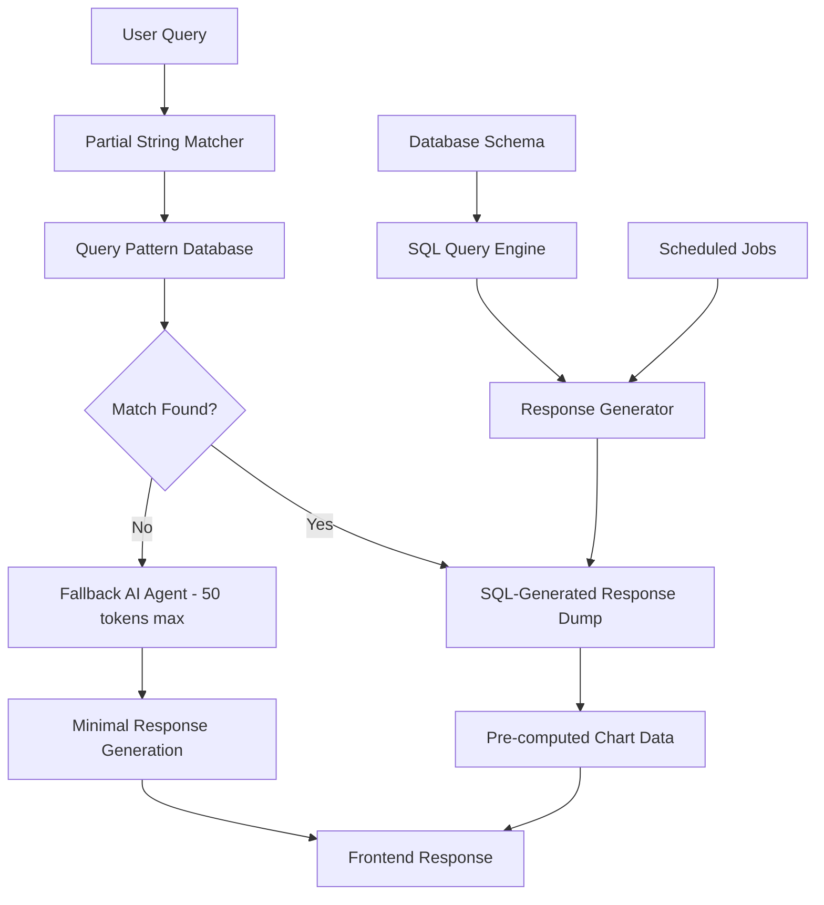

# Design Document

## Overview

The Token-Optimized Business Intelligence System implements a deterministic architecture that serves 90%+ of queries from pre-computed SQL-based dumps while using minimal AI tokens for query matching. The system leverages existing database schema to pre-generate responses for all possible query patterns, using partial string matching to select appropriate responses from static dumps. This approach addresses the 10,000 token per minute constraint by making the system largely deterministic with SQL-powered data generation.

## Architecture

### High-Level Architecture



### System Prompt Optimization

**Token Overhead Reduction:**
- System prompts DO consume tokens (typically 200-500 tokens per request)
- Optimized system prompts: 50-100 tokens maximum
- Context reuse across multiple queries in same session
- Role-specific micro-prompts instead of comprehensive instructions

## Components and Interfaces

### 1. Partial String Matcher

**Purpose:** Matches user queries to pre-computed SQL-based responses using deterministic pattern matching

**Matching Logic:**
```typescript
interface QueryMatch {
  pattern: string;
  confidence: number;
  responseKey: string;
  sqlQuery: string;
  parameters?: Record<string, any>;
}
```

**Pre-computed Query Patterns (Based on DB Schema):**
- "top selling models" → `SELECT model, SUM(sales) FROM sales_data WHERE region='%s' AND date >= '%s'`
- "KPI health score" → `SELECT kpi_name, current_value, target_value FROM kpi_dashboard WHERE date='%s'`
- "inventory levels" → `SELECT model, factory, current_stock FROM inventory WHERE date='%s'`
- "warranty claims" → `SELECT COUNT(*), model FROM warranty_claims WHERE date >= '%s' GROUP BY model`
- "dealer performance" → `SELECT dealer_id, sales_count, conversion_rate FROM dealer_metrics WHERE date >= '%s'`

**Fallback Patterns (Minimal AI - 50 tokens max):**
- Unrecognized queries get simple template responses
- "I found similar data about [closest_match]" with link to relevant dump

### 2. SQL-Generated Response Dumps

**File Organization (Generated from DB Schema):**
```
/sql_dumps/
├── sales_analytics/
│   ├── top_models_by_region_daily.json     # Generated from sales_data table
│   ├── dealer_performance_weekly.json      # Generated from dealer_metrics table
│   └── conversion_rates_monthly.json       # Generated from sales_funnel table
├── kpi_monitoring/
│   ├── health_scores_daily.json           # Generated from kpi_dashboard table
│   ├── variance_reports_weekly.json       # Generated from variance_tracking table
│   └── anomaly_alerts_realtime.json       # Generated from anomaly_detection table
├── inventory_management/
│   ├── stock_levels_by_factory.json       # Generated from inventory table
│   ├── stockout_risks_daily.json          # Generated from inventory + demand_forecast
│   └── component_availability.json        # Generated from parts_inventory table
├── warranty_analysis/
│   ├── claims_by_model_monthly.json       # Generated from warranty_claims table
│   ├── repeat_repairs_quarterly.json      # Generated from service_history table
│   └── failure_patterns_weekly.json       # Generated from defect_tracking table
└── executive_reports/
    ├── ceo_digest_weekly.json             # Aggregated from multiple tables
    ├── margin_analysis_monthly.json       # Generated from financial_metrics table
    └── risk_matrix_daily.json             # Generated from risk_assessment table
```

**Chart Data Structure:**
```json
{
  "query_id": "top_selling_models_northeast",
  "data": {
    "datasets": [...],
    "labels": [...],
    "chartType": "bar",
    "options": {
      "responsive": true,
      "plugins": {
        "title": { "text": "Top Selling Models - Northeast" }
      }
    }
  },
  "metadata": {
    "lastUpdated": "2024-12-12T10:00:00Z",
    "dataSource": "sales_db",
    "refreshFrequency": "daily"
  }
}
```

### 3. Chart Data Generator

**Frontend Integration:**
- Generates Chart.js/D3.js compatible configurations
- Supports drill-down through hierarchical data structures
- Enables client-side filtering and interaction
- Provides export capabilities (PNG, PDF, CSV)

**Chart Types Supported:**
- Time series (line charts)
- Comparative analysis (bar/column charts)
- Distribution analysis (pie/donut charts)
- Correlation analysis (scatter plots)
- Geographic analysis (heat maps)

### 4. SQL Query Pattern Matcher

**Deterministic Matching:**
```typescript
interface SQLPattern {
  keywords: string[];
  sqlTemplate: string;
  responseFile: string;
  parameters: string[];
}
```

**Example Patterns Based on Your DB:**
```typescript
const patterns = [
  {
    keywords: ["top", "selling", "models", "northeast"],
    sqlTemplate: "SELECT model_name, SUM(units_sold) FROM sales_data WHERE region='Northeast' AND date >= DATE_SUB(NOW(), INTERVAL 7 DAY) GROUP BY model_name ORDER BY SUM(units_sold) DESC LIMIT 10",
    responseFile: "sales_analytics/top_models_northeast_weekly.json",
    parameters: []
  },
  {
    keywords: ["warranty", "claims", "year", "over", "year"],
    sqlTemplate: "SELECT model_name, COUNT(*) as claims_count, YEAR(claim_date) FROM warranty_claims WHERE claim_date >= DATE_SUB(NOW(), INTERVAL 2 YEAR) GROUP BY model_name, YEAR(claim_date)",
    responseFile: "warranty_analysis/yoy_claims_comparison.json",
    parameters: []
  },
  {
    keywords: ["inventory", "levels", "factory"],
    sqlTemplate: "SELECT factory_location, model_name, current_stock, reorder_point FROM inventory WHERE date = CURDATE()",
    responseFile: "inventory_management/current_stock_levels.json",
    parameters: []
  }
];
```

### 5. Fallback Response Generator

**Minimal AI Processing (50 tokens max):**
- Used only when no pattern match found
- Simple template responses pointing to available data
- No complex analysis, just helpful redirection

**Example Fallback Response:**
```
System Prompt (30 tokens): "User asked about [query]. Suggest closest available report from: [list_of_available_dumps]"
Response (20 tokens): "I found related data about [closest_topic]. Check the [specific_report_name] for details."
```

## SQL-Based Response Generation

### Database Schema Integration

**Leveraging Existing Tables:**
```sql
-- Core tables for pre-computed responses
sales_data (date, region, model_name, units_sold, revenue)
dealer_metrics (date, dealer_id, sales_count, conversion_rate)
inventory (date, factory_location, model_name, current_stock, reorder_point)
warranty_claims (claim_date, model_name, component, failure_type)
kpi_dashboard (date, kpi_name, current_value, target_value, variance)
service_history (service_date, model_name, repair_type, technician_id)
financial_metrics (date, region, revenue, margin, costs)
```

### Scheduled SQL Dump Generation

**Daily Jobs (Run at 2 AM):**
```sql
-- Top selling models by region (last 7 days)
SELECT region, model_name, SUM(units_sold) as total_sales 
FROM sales_data 
WHERE date >= DATE_SUB(CURDATE(), INTERVAL 7 DAY) 
GROUP BY region, model_name 
ORDER BY region, total_sales DESC;

-- KPI health scores (current day)
SELECT kpi_name, current_value, target_value, 
       ROUND(((current_value - target_value) / target_value) * 100, 2) as variance_percent
FROM kpi_dashboard 
WHERE date = CURDATE();

-- Inventory stockout risks
SELECT factory_location, model_name, current_stock, reorder_point,
       CASE WHEN current_stock <= reorder_point THEN 'HIGH' 
            WHEN current_stock <= reorder_point * 1.5 THEN 'MEDIUM' 
            ELSE 'LOW' END as risk_level
FROM inventory 
WHERE date = CURDATE();
```

**Weekly Jobs (Run Sunday 3 AM):**
```sql
-- Executive summary data
SELECT 
  'Sales Performance' as category,
  SUM(revenue) as total_revenue,
  COUNT(DISTINCT dealer_id) as active_dealers,
  AVG(conversion_rate) as avg_conversion
FROM sales_data s 
JOIN dealer_metrics d ON s.date = d.date 
WHERE s.date >= DATE_SUB(CURDATE(), INTERVAL 7 DAY);

-- Warranty trend analysis
SELECT model_name, 
       COUNT(*) as claim_count,
       COUNT(DISTINCT component) as affected_components
FROM warranty_claims 
WHERE claim_date >= DATE_SUB(CURDATE(), INTERVAL 30 DAY)
GROUP BY model_name
ORDER BY claim_count DESC;
```

### Pattern Matching Algorithm

**String Matching Logic:**
```python
def find_best_match(user_query: str) -> Optional[str]:
    query_lower = user_query.lower()
    
    # Exact keyword matching
    for pattern in sql_patterns:
        keyword_matches = sum(1 for keyword in pattern.keywords 
                            if keyword in query_lower)
        match_ratio = keyword_matches / len(pattern.keywords)
        
        if match_ratio >= 0.6:  # 60% keyword match threshold
            return pattern.response_file
    
    # Fuzzy matching for partial matches
    for pattern in sql_patterns:
        fuzzy_score = calculate_fuzzy_match(query_lower, pattern.keywords)
        if fuzzy_score >= 0.4:  # 40% fuzzy match threshold
            return pattern.response_file
    
    return None  # Trigger fallback AI response
```

## Data Models

### SQL Dump Entry Model
```typescript
interface SQLDumpEntry {
  id: string;
  sql_query: string;
  keywords: string[];
  data: any;
  chart_config?: ChartConfiguration;
  metadata: {
    generated_at: Date;
    source_tables: string[];
    refresh_schedule: 'daily' | 'weekly' | 'monthly';
    row_count: number;
    file_size_kb: number;
  };
}
```

### Chart Configuration Model
```typescript
interface ChartConfiguration {
  type: 'line' | 'bar' | 'pie' | 'scatter' | 'heatmap';
  data: {
    labels: string[];
    datasets: Dataset[];
  };
  options: ChartOptions;
  interactions: {
    drill_down?: DrillDownConfig;
    filters?: FilterConfig[];
    exports?: ExportConfig[];
  };
}
```

### Token Usage Model
```typescript
interface TokenUsage {
  timestamp: Date;
  query_type: 'static' | 'template' | 'dynamic';
  tokens_consumed: number;
  system_prompt_tokens: number;
  user_query_tokens: number;
  response_tokens: number;
  cache_hit: boolean;
}
```

## Correctness Properties

*A property is a characteristic or behavior that should hold true across all valid executions of a system-essentially, a formal statement about what the system should do. Properties serve as the bridge between human-readable specifications and machine-verifiable correctness guarantees.*

### Property Reflection

After analyzing all acceptance criteria, several properties can be consolidated to eliminate redundancy:

- Cache response properties (1.1, 1.2, 1.3) can be combined into a comprehensive cache serving property
- Chart data properties (2.1, 2.2, 2.3) can be unified into a single chart structure validation property  
- Token optimization properties (5.1, 5.2, 5.4) can be consolidated into one token efficiency property
- Cache refresh properties (6.1, 6.2, 6.3) can be combined into a cache lifecycle property

### Core Properties

**Property 1: Pattern matching eliminates AI token usage**
*For any* query with 60%+ keyword match, the system should serve responses from SQL dumps without consuming any AI tokens
**Validates: Requirements 1.1, 1.2, 4.2**

**Property 2: Chart data structure compatibility**
*For any* chart data response, the structure should be compatible with frontend charting libraries and include all required visualization metadata
**Validates: Requirements 2.1, 2.2, 2.3, 2.4**

**Property 3: Response time performance for cached data**
*For any* static query, the response time should be under 200ms when served from cache
**Validates: Requirements 1.5**

**Property 4: Pattern matching accuracy**
*For any* incoming query, the pattern matching system should correctly identify matching SQL dumps based on keyword analysis
**Validates: Requirements 4.1**

**Property 5: Fallback token efficiency**
*For any* unmatched query, the fallback response should consume under 50 tokens while providing helpful redirection
**Validates: Requirements 4.3, 5.1, 5.4**

**Property 6: Token budget prioritization**
*For any* AI processing session, user query tokens should be prioritized over system overhead tokens
**Validates: Requirements 5.5**

**Property 7: Context reuse optimization**
*For any* multi-query session, subsequent queries should reuse system context to reduce token consumption
**Validates: Requirements 5.3**

**Property 8: SQL dump lifecycle management**
*For any* SQL dump file, when scheduled jobs run, the dumps should be automatically refreshed with updated timestamps and validation
**Validates: Requirements 6.1, 6.2, 6.5**

**Property 9: Dependency-based cache invalidation**
*For any* data dependency change, all affected cache files should be identified and refreshed appropriately
**Validates: Requirements 6.3**

**Property 10: Token usage monitoring and alerting**
*For any* token consumption, the system should track usage in real-time and trigger alerts when approaching limits
**Validates: Requirements 8.1, 8.3**

**Property 11: Client-side chart interactivity**
*For any* chart customization or filtering request, the system should handle it client-side without consuming backend tokens
**Validates: Requirements 9.3, 9.4**

**Property 12: Incremental chart updates**
*For any* chart data change, the system should update configurations without regenerating entire datasets
**Validates: Requirements 9.1, 9.2**

**Property 13: Complex query decomposition**
*For any* complex analytical query, the system should break it into cacheable components and minimal dynamic processing
**Validates: Requirements 10.1, 10.2**

**Property 14: Hybrid analysis efficiency**
*For any* comparative or predictive analysis, the system should leverage cached data with minimal AI processing for insights
**Validates: Requirements 10.3, 10.4, 10.5**

## Error Handling

### Cache Miss Scenarios
- **Graceful Degradation**: When cache misses occur, route to template or dynamic processing
- **Fallback Mechanisms**: Maintain backup cache files for critical queries
- **Error Notifications**: Alert administrators when cache generation fails

### Token Limit Exceeded
- **Intelligent Queuing**: Queue dynamic queries when approaching token limits
- **Priority Routing**: Prioritize executive and critical business queries
- **User Feedback**: Provide clear messaging about processing delays

### Chart Generation Failures
- **Default Visualizations**: Provide basic chart configurations when custom generation fails
- **Data Export Options**: Always maintain CSV/JSON export capabilities
- **Progressive Enhancement**: Start with basic charts, enhance with available resources

## Testing Strategy

### Dual Testing Approach

The system requires both unit testing and property-based testing to ensure comprehensive coverage:

**Unit Testing Focus:**
- Specific cache file structures and formats
- Chart configuration validation for known chart types
- Token counting accuracy for sample queries
- Error handling for specific failure scenarios

**Property-Based Testing Focus:**
- Token consumption properties across random query sets
- Cache hit rates with generated query patterns  
- Chart data structure validation across random datasets
- Response time properties under various load conditions

**Property-Based Testing Library:** 
We will use **Hypothesis** for Python-based property testing, configured to run a minimum of 100 iterations per property test.

**Property Test Tagging:**
Each property-based test will be tagged with the format: `**Feature: token-optimized-bi-system, Property {number}: {property_text}**`

### Integration Testing
- End-to-end query processing workflows
- Frontend chart rendering with cached data
- Token budget management under realistic load
- Cache refresh cycles with live data sources

### Performance Testing
- Response time validation for cached queries
- Token consumption measurement across query types
- Concurrent user load testing within token constraints
- Cache generation performance during off-peak hours