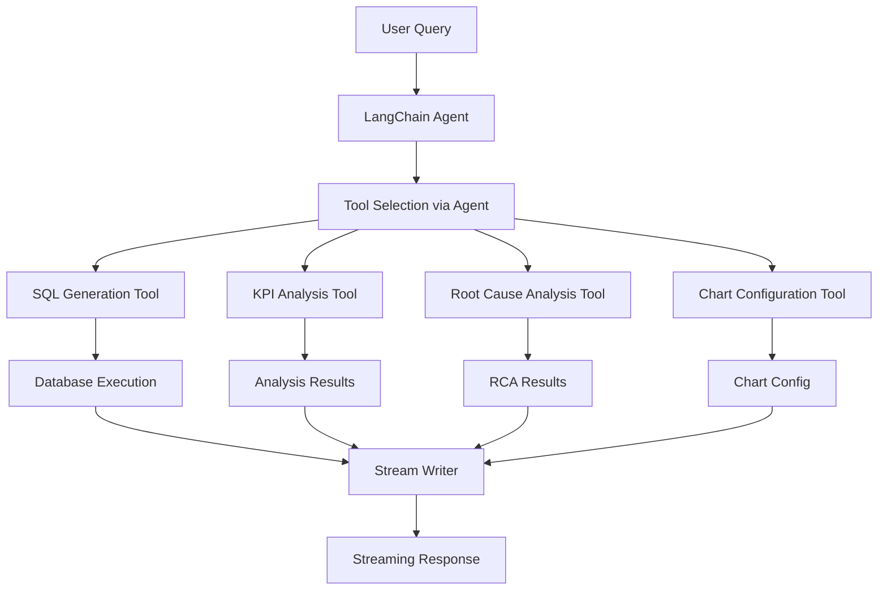

# Design Document

## Overview

This design refactors the Cox Automotive AI Analytics orchestrator from a manual agent coordination system to a modern LangChain tools-based architecture with streaming capabilities. The new design leverages LangChain's `create_agent` function, `@tool` decorators, and streaming APIs to create a more flexible, maintainable, and extensible system.

The current orchestrator manually routes queries between different agents (QueryClassifier, SQLAgent, KPIAgent) using hardcoded logic. The new design will use LangChain's `create_agent` function which implements the ReAct pattern where a single agent intelligently selects and sequences tools based on the query requirements.

## Architecture

### High-Level Architecture



### Component Architecture

The new architecture consists of:

1. **LangChain Agent**: Central coordinator using `create_agent()`
2. **Tool Collection**: Individual tools implementing specific capabilities
3. **Streaming Layer**: Real-time response delivery using `agent.stream()`
4. **Error Handling**: Middleware for robust tool error management
5. **Context Management**: Runtime context for database sessions and user state

## Components and Interfaces

### Core Agent Component

```python
class AnalyticsOrchestrator:
    def __init__(self, db_session_factory):
        self.agent = create_agent(
            model=ChatOpenAI(model=settings.openai_model, temperature=0.3),
            tools=[
                sql_generation_tool,
                kpi_analysis_tool,
                root_cause_analysis_tool,
                chart_configuration_tool
            ],
            system_prompt=self._get_system_prompt(),
            middleware=[tool_error_handler]
        )
        self.db_session_factory = db_session_factory
    
    async def process_query_stream(self, query: str, context: dict = None):
        """Stream processing of user queries"""
        async for chunk in self.agent.stream(
            {"messages": [HumanMessage(content=query)]},
            context=context
        ):
            yield chunk
```

### Tool Interfaces

Each tool follows the LangChain `@tool` pattern with proper schemas:

```python
@tool
def sql_generation_tool(query: str, runtime: ToolRuntime) -> str:
    """Generate SQL query from natural language question.
    
    Args:
        query: Natural language question about data
    """
    
@tool  
def kpi_analysis_tool(data: List[Dict], query_type: str, runtime: ToolRuntime) -> Dict:
    """Analyze KPI data and provide insights.
    
    Args:
        data: Query results from database
        query_type: Type of analysis requested
    """
```

## Data Models

### Tool Input/Output Schemas

```python
from pydantic import BaseModel, Field
from typing import List, Dict, Any, Optional

class SQLGenerationInput(BaseModel):
    query: str = Field(description="Natural language question")
    context: Optional[Dict] = Field(default=None, description="Additional context")

class KPIAnalysisInput(BaseModel):
    data: List[Dict] = Field(description="Query results from database")
    query_type: str = Field(description="Type of analysis (fni_analysis, logistics_analysis, etc.)")
    original_query: str = Field(description="Original user question")

class AnalysisOutput(BaseModel):
    analysis: str = Field(description="Generated analysis text")
    recommendations: List[str] = Field(description="Actionable recommendations")
    timestamp: str = Field(description="Analysis timestamp")

class ChartConfigOutput(BaseModel):
    type: str = Field(description="Chart type (bar, pie, line, etc.)")
    title: str = Field(description="Chart title")
    x_axis: str = Field(description="X-axis field name")
    y_axis: str = Field(description="Y-axis field name")
    labels: Optional[str] = Field(default=None, description="Labels field for pie charts")
    values: Optional[str] = Field(default=None, description="Values field for pie charts")
```

### Runtime Context Schema

```python
@dataclass
class AnalyticsContext:
    db_session: Any
    user_id: Optional[str] = None
    conversation_history: List[Dict] = field(default_factory=list)
    demo_mode: bool = False
```
Now I n
eed to complete the prework analysis before writing the Correctness Properties section.
## Correctness Properties

*A property is a characteristic or behavior that should hold true across all valid executions of a system-essentially, a formal statement about what the system should do. Properties serve as the bridge between human-readable specifications and machine-verifiable correctness guarantees.*

### Property Reflection

After analyzing the acceptance criteria, several properties can be consolidated to eliminate redundancy:

- Properties 3.1-3.4 (tool implementation compliance) can be combined into a single comprehensive property about tool implementation standards
- Properties 5.1-5.5 (functional equivalence) can be combined into a single property about maintaining behavioral compatibility
- Properties 4.1-4.5 (intelligent tool selection) represent distinct aspects of tool coordination and should remain separate

### Core Properties

**Property 1: Tool extensibility without core changes**
*For any* new tool that follows the @tool decorator pattern, adding it to the tools list should make it available to the agent without requiring changes to the orchestrator's core logic
**Validates: Requirements 1.2**

**Property 2: Tool compliance standards**
*For any* tool in the system, it should use the @tool decorator, have proper type hints, comprehensive docstrings, and valid input/output schemas
**Validates: Requirements 1.3, 3.5**

**Property 3: Multi-tool coordination via ReAct**
*For any* query requiring multiple tools, the agent should coordinate their execution through the ReAct pattern, calling tools in logical sequence
**Validates: Requirements 1.4**

**Property 4: Error handling middleware activation**
*For any* tool execution failure, the system should invoke the @wrap_tool_call middleware and return a properly formatted error message
**Validates: Requirements 1.5**

**Property 5: Streaming progress updates**
*For any* tool execution, when the tool uses ToolRuntime.stream_writer, the updates should be included in the agent's stream output
**Validates: Requirements 2.2**

**Property 6: LLM response streaming**
*For any* query that generates LLM responses, the agent.stream() method should yield incremental chunks as they are produced
**Validates: Requirements 2.3**

**Property 7: Streaming interruption handling**
*For any* streaming session that is interrupted, the system should handle the disconnection gracefully without leaving resources in an inconsistent state
**Validates: Requirements 2.4**

**Property 8: Intelligent SQL tool selection**
*For any* query that requires data retrieval, the agent should automatically select and execute the SQL generation tool
**Validates: Requirements 4.1**

**Property 9: Analysis tool selection by query type**
*For any* query requiring analysis, the agent should select the appropriate analysis tool based on the detected query type (F&I, logistics, plant, etc.)
**Validates: Requirements 4.2**

**Property 10: Tool dependency sequencing**
*For any* query requiring dependent tools, the agent should execute tools in the correct sequence where outputs from one tool serve as inputs to subsequent tools
**Validates: Requirements 4.4, 4.5**

**Property 11: Functional equivalence preservation**
*For any* query type supported by the current implementation, the refactored system should produce functionally equivalent results in terms of analysis quality, insights, and chart configurations
**Validates: Requirements 5.1, 5.2, 5.3, 5.4, 5.5**

## Error Handling

### Tool Error Handling Strategy

The system implements comprehensive error handling through LangChain middleware:

```python
@wrap_tool_call
def tool_error_handler(request, handler):
    """Handle tool execution errors with context-aware messages."""
    try:
        return handler(request)
    except DatabaseError as e:
        return ToolMessage(
            content=f"Database error: {str(e)}. Please check your query and try again.",
            tool_call_id=request.tool_call["id"]
        )
    except ValidationError as e:
        return ToolMessage(
            content=f"Input validation error: {str(e)}. Please check your parameters.",
            tool_call_id=request.tool_call["id"]
        )
    except Exception as e:
        return ToolMessage(
            content=f"Tool execution failed: {str(e)}. Please try rephrasing your query.",
            tool_call_id=request.tool_call["id"]
        )
```

### Streaming Error Handling

Streaming operations include proper async context management and graceful degradation:

- Connection interruptions are handled through async context managers
- Partial results are preserved and can be resumed
- Error states are clearly communicated through the stream
- Resource cleanup is guaranteed even on unexpected disconnections

### Database Error Handling

Database-related errors are handled at the tool level:

- SQL syntax errors provide helpful feedback for query refinement
- Connection timeouts trigger automatic retry logic
- Transaction rollbacks ensure data consistency
- Connection pool exhaustion is handled gracefully

## Testing Strategy

### Unit Testing Approach

Unit tests will focus on:

- Individual tool functionality and schema validation
- Error handling middleware behavior
- Database connection and query execution
- Stream chunk formatting and completion indicators
- Context management and state preservation

### Property-Based Testing Approach

The system will use **Hypothesis** for Python property-based testing with a minimum of 100 iterations per property test. Each property-based test will be tagged with comments explicitly referencing the correctness property from this design document.

Property-based tests will verify:

- Tool extensibility across various tool configurations
- Streaming behavior across different query types and sizes
- Error handling across various failure scenarios
- Tool selection logic across diverse query patterns
- Functional equivalence across comprehensive query sets

**Property-based testing requirements:**
- Each correctness property will be implemented by a single property-based test
- Tests will run a minimum of 100 iterations for statistical confidence
- Each test will be tagged using the format: `**Feature: langchain-orchestrator-refactor, Property {number}: {property_text}**`
- Tests will use smart generators that constrain inputs to valid query patterns and data structures

### Integration Testing

Integration tests will verify:

- End-to-end query processing through the complete pipeline
- Database integration with real query execution
- Streaming integration with actual WebSocket connections
- Error propagation through the entire system
- Performance characteristics under load

### Compatibility Testing

Compatibility tests will ensure:

- Functional equivalence with the current implementation
- API compatibility for existing clients
- Performance parity or improvement
- Demo scenario preservation